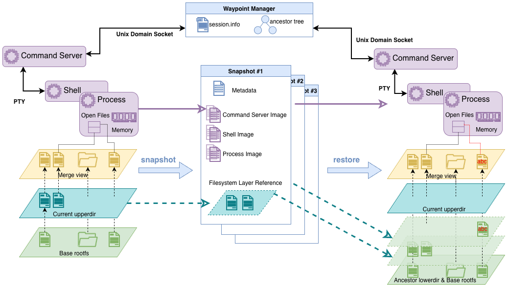

# Waypoint

A lightweight checkpoint/restore tool that captures both filesystem and memory state with minimal overhead. 
Built on top of CRIU and OverlayFS for fast, isolated process state management.

> **Naming note:** Waypoint was previously called **Checkpoint-lite**. Some older blog posts, videos, and public announcements may still use the Checkpoint-lite name; they refer to the same project lineage.

## Overview 🌟

`waypoint` provides a simple interface to checkpoint and restore running processes while capturing all their 
memory state, live terminal sessions, and filesystem changes. Unlike heavyweight container solutions, this tool focuses
on minimal overhead by directly orchestrating existing kernel features and redesigning terminal session management.

### Key Features

- **Hybrid State Capture**: Combines filesystem (OverlayFS) and memory (CRIU) checkpointing
- **Terminal Session Support**: Preserves live terminal sessions and their state across checkpoints
- **Multi-Session Support**: Concurrent usage by multiple applications with isolated sessions
- **Minimal Overhead**: Direct system calls without unnecessary container abstractions
- **Minimal File IO**: Uses multiple lower-layer designs to achieve true inter-checkpoint deduplication
- **Simple CLI**: Straightforward command-line interface for checkpoint operations
- **Session Management**: Automatic cleanup and resource management

## Architecture 🧱

### Design Philosophy

After analysis of existing checkpoint/restore solutions using our analysis tool [StateFork](https://github.com/Alex-XJK/StateFork)
and [StraceTools](https://github.com/Alex-XJK/stracetools), we identified that many traditional solutions often bundle 
unnecessary features like network isolation, security policies, and registry operations. 
`waypoint` takes a minimalist approach:

1. **Filesystem State**: Uses OverlayFS to capture directory changes without copying entire filesystems
2. **Memory State**: Leverages CRIU for process memory and execution state
3. **Terminal Sessions**: Implements a custom RPC-style PTY session management to preserve live terminal sessions across checkpoints
4. **Isolation**: Session-based isolation instead of full containerization
5. **Performance**: Direct tool orchestration minimizes call overhead

### Core Components

```
┌─────────────────┐    ┌─────────────────┐           ┌─────────────────┐
│   Filesystem    │    │     Memory      │ ───────── │   PTY Session   │
│   (OverlayFS)   │    │     (CRIU)      │           │   Management    │
└─────────────────┘    └─────────────────┘           └─────────────────┘
         │                       │
         └───────────┬───────────┘
                     │
            ┌─────────────────┐
            │   waypoint      │
            │   Session Mgr   │
            └─────────────────┘
```

- **OverlayFS Integration**: Creates layered filesystem views with minimal storage overhead
- **CRIU Orchestration**: Manages process memory dumping and restoration
- **PTY Session Management**: Uses an RPC-style approach to capture and communicate with terminal sessions
- **Session Manager**: Handles concurrent usage and resource isolation

### Go Language Technology Decision
The tool is implemented in Go for its simplicity, performance, and strong concurrency support.
See [our architecture decision record](./docs/tech_selection_note.md) for more details on why Go was chosen.

## Installation 🔧

### Prerequisites

- Linux system with root privileges
- CRIU installed and configured
- OverlayFS support (most modern Linux distributions)
- Go 1.25 or the version listed in `go.mod` (for building from source)
- Optional: `buildah` for the build from Dockerfile approach (since v0.5.0)

### Install Go (just for reference)
```bash
# Install Go (version 1.25.0)
wget https://go.dev/dl/go1.25.0.linux-amd64.tar.gz
sudo rm -rf /usr/local/go && sudo tar -C /usr/local -xzf go1.25.0.linux-amd64.tar.gz

# Add to ~/.bashrc or ~/.profile
export PATH=$PATH:/usr/local/go/bin
export GOPATH=$HOME/go
export GOBIN=$GOPATH/bin

# Reload shell
source ~/.bashrc

# Verify installation
go version
```

### Install CRIU

```bash
# Ubuntu/Debian
sudo apt-get install criu
# or go to https://launchpad.net/~criu/+archive/ubuntu/ppa

# Verify installation
sudo criu check
```

### Build from Source

```bash
git clone https://github.com/Alex-XJK/waypoint.git
cd waypoint
go build -o waypoint cmd/waypoint/main.go
go build -o bash_init cmd/bash-init/main.go
```

### Check Waypoint Version

```bash
./waypoint version
# Output: waypoint version v0.6.0
```

## Usage 🗂

### 0. [Optional] Configure Global Settings

You can create a configuration file to set global options. Example content:
```json
{
  "sessions_dir": "/custom/path/waypoint-sessions",
  "bash_init_src": "/custom/compiled/bash_init",
  "preserve_session_on_cleanup": false
}
```

Configuration takes effect in the following order of precedence:
1. The direct environment variable `WAYPOINT_SESSIONS_DIR`, `WAYPOINT_BASH_INIT_SRC`, `WAYPOINT_PRESERVE_SESSION_ON_CLEANUP`, etc. (if set)
2. Load from configuration file (if exists):
   - Explicit `WAYPOINT_CONFIG` environment variable
   - Binary-side config: `./config.json` (same dir as executable)
   - User config: `$XDG_CONFIG_HOME/waypoint/config.json` or `~/.waypoint/config.json`
   - System config: `/etc/waypoint/config.json`
3. Default settings.

### 1. Initialize Environment

#### 1.1. Initialize with Workspace

Create a managed environment for your application:

```bash
sudo ./waypoint init /path/to/your/workspace
```

Output:
```
Environment initialized!
Session ID: a1b2c3d4e5f6g7h8
Work in this directory: /tmp/waypoint-sessions/a1b2c3d4e5f6g7h8/work

Save the session ID for future operations!
```

**Important**: Save the session ID and work in the provided directory.

Special options:
- `--quiet` to output only the session ID and work directory, separated by a comma. (Since v0.2.1)
- `--shell` to start a shell in the managed environment immediately after initialization. (Since v0.5.0)
  - You should make sure the provided workspace contains the necessary files for the shell to work, e.g., `/bin/bash`.

#### 1.2. Build Environment with Dockerfile (since v0.5.0)

You can alternatively build a sandbox environment directly with the `build` command, just like a Docker build.
This will set up a sandboxed environment with the provided Dockerfile and start a bash session in it.

```bash
sudo ./waypoint build /path/to/your/Dockerfile-directory
```

Output:
```
(Some build output from buildah...)
Sandbox environment built successfully!
Session ID: a1b2c3d4e5f6g7h8
Work in this directory: /tmp/waypoint-sessions/a1b2c3d4e5f6g7h8/work
Sandbox bash PID: 1234

Save the session ID for future operations!
```

Special options:
- `--quiet` to output only the session ID, work directory, and bash PID, separated by commas.

> Credit: This `buildah`-based workflow was originally designed by [Tianle Zhou](https://www.linkedin.com/in/tian-le-zhou-99a145221/)
in his TBench integration for v0.2.0.

### 2. Run Your Application

#### 2.1. Manual Execution

The simplest way is to just run your application in the provided work directory.

```bash
cd /tmp/waypoint-sessions/a1b2c3d4e5f6g7h8/work
./your-application &
# Note the PID, e.g., 1234
```

#### 2.2. Execute Shell Commands

Since v0.3.0, you can also execute shell commands directly in the managed environment.

Since v0.5.0, if you used the `--shell` option during initialization or the `build` command, we provide you with an isolated
shell session in the managed environment. You can directly run your bash commands there without worrying about the workspace isolation.

```bash
sudo ./waypoint exec a1b2c3d4e5f6g7h8 cat hello_world.txt
```

Note that the `exec` command can be used all the time, regardless of whether you started a shell session or not.

If you have a shell session, the `exec` command will execute using a long-running shell session, and will be able to preserve
state across multiple `exec` calls and also across checkpoints.
If you don't have a shell session, the `exec` will simply help you execute the command in the correct workspace.

### 3. Create Checkpoints

```bash
sudo ./waypoint create a1b2c3d4e5f6g7h8 checkpoint-name 1234
```

Special options:
- Since v0.2.0, if you want to create a checkpoint without the memory state, you can set the PID to `-1`. 
  - However, this should only be used if you are sure that the application does not relate to the managed directory, or you are not running any application at all and simply want to capture the filesystem state.
- Since v0.5.0, if you did not provide a PID during checkpoint creation, we will automatically checkpoint the long-running shell session (if it exists). 
  - This is especially useful when you start a shell session with `--shell` or the `build` command, as you can simply checkpoint the shell session without worrying about the PID.

### 4. Restore From Checkpoint

```bash
sudo ./waypoint restore a1b2c3d4e5f6g7h8 checkpoint-name
```

### 5. List Available Checkpoints

```bash
sudo ./waypoint list a1b2c3d4e5f6g7h8
```

### 6. Clean Up Session

```bash
sudo ./waypoint cleanup a1b2c3d4e5f6g7h8
```
If this basic version of the cleanup command fails, **waypoint** will automatically suggest further actions. You can use:
- `--force` to forcefully remove and unmount all related resources.

For debugging, set `preserve_session_on_cleanup` to `true` in the config file, or set `WAYPOINT_PRESERVE_SESSION_ON_CLEANUP=true`. Cleanup will still stop processes and unmount resources, but it will keep the session directory and session registry entry for inspection.

## Demo 🎥

- **Direct CLI Usage** – Using waypoint directly from the terminal: https://youtu.be/fbNlGyIndjc
- **StateFork Integration** – Using waypoint as a backend inside StateFork’s interactive shell: https://youtu.be/oe8ONkqr2a8

## Example Workflow 🧩

### Example 1: Checkpointing a Simulator Application
```bash
# Initialize environment
sudo ./waypoint init /home/user/myproject
## Environment initialized!
## Session ID: abc123def456
## Work in this directory: /tmp/waypoint-sessions/abc123def456/work
##
## Save the session ID for future operations!

# Run application in managed directory
cd /tmp/waypoint-sessions/abc123def456/work
./my-simulator --config config.json &
## [1] 5678

# Create checkpoints after some computation
sudo ./waypoint create abc123def456 simulation-step-100 5678
## Checkpoint 'simulation-step-100' created successfully

# Continue running, create another checkpoint
sudo ./waypoint create abc123def456 simulation-step-200 5678
## Checkpoint 'simulation-step-200' created successfully

# List available checkpoints
sudo ./waypoint list abc123def456
## Available checkpoints:
##   simulation-step-100
##   simulation-step-200

# Restore to earlier state
sudo ./waypoint restore abc123def456 simulation-step-100
## Checkpoint 'simulation-step-100' restored, new PID: 5678

# Clean up when done
sudo ./waypoint cleanup abc123def456
## Session 'abc123def456' cleaned up successfully
```

### Example 2: Checkpointing with a Shell Session
```bash
# Initialize environment using a Dockerfile
sudo ./waypoint build /home/docker-tasks/context
## STEP 1/3: FROM ubuntu-24-04:latest
## (Some build output from buildah...)
## Sandbox environment built successfully!
## Session ID: abc123def456
## Work in this directory: /mydata/waypoint-sessions/abc123def456/work
## Sandbox bash PID: 123456
##
## Save the session ID for future operations!

# Run some commands in the provided shell session
sudo ./waypoint exec abc123def456 cd /app
sudo ./waypoint exec abc123def456 export ENV_VAR=start

# Create a checkpoint of the shell session
sudo ./waypoint create abc123def456 before-run
## Checkpoint 'before-run' created successfully

# Continue running some commands
sudo ./waypoint exec abc123def456 "echo VALUE: \$ENV_VAR PWD: \$(pwd)"
## VALUE: start PWD: /app
sudo ./waypoint exec abc123def456 ./run-app.sh
sudo ./waypoint exec abc123def456 export ENV_VAR=finished
sudo ./waypoint exec abc123def456 cd ./results
sudo ./waypoint exec abc123def456 ls
## (Output from ls, e.g., result1.txt result2.txt)

# Create another checkpoint
sudo ./waypoint create abc123def456 after-run
## Checkpoint 'after-run' created successfully

# Continue running some commands
sudo ./waypoint exec abc123def456 "echo VALUE: \$ENV_VAR PWD: \$(pwd)"
## VALUE: finished PWD: /app/results

# Restore to earlier state
sudo ./waypoint restore abc123def456 before-run
## Checkpoint 'before-run' restored, new PID: 123456
sudo ./waypoint exec abc123def456 "echo VALUE: \$ENV_VAR PWD: \$(pwd)"
## VALUE: start PWD: /app

# Clean up when done
sudo ./waypoint cleanup abc123def456
```

## Directory Structure 🗃

```
/custom/path/waypoint-sessions/   # Configured sessions directory
    ├── a1b2c3d4e5f6g7h8/           # App A's session
    │   ├── current/                # Current OverlayFS mounts
    │   │   ├── upper/              # Overlay upper directory
    │   │   └── work/               # Overlay work directory
    │   ├── ckpt-1/                 # Checkpoint ckpt-1
    │   │   ├── upper/
    │   │   └── criu/               # CRIU image files
    │   │       └── *.img
    │   ├── metadata/               # Checkpoint metadata
    │   │   └── ckpt-1.json         # "Metadata" for ckpt-1
    │   ├── temp/                   # Internal temporary files (e.g., for shell socket and logs)
    │   └── work/                   # App A works here (Overlay merged view)
    └── x9y8z7w6v5u4t3s2/           # App B's session
     	├── current/
    	├── ckpt-a/
     	├── metadata/
     	├── temp/
      	└── work/
  
 /tmp/waypoint-sessions-info/     # Global session registry
    ├── a1b2c3d4e5f6g7h8.json       # "SessionInfo" for App A
    └── x9y8z7w6v5u4t3s2.json       # "SessionInfo" for App B
```

## Technical Details ⌨️



### OverlayFS Initialization
- **Lower Layer**: Original workspace (read-only)
- **Upper Layer**: Application changes (copy-on-write)
- **Work Layer** (`~/current/work/`): Temporary storage for OverlayFS internal operations
- **Merges** (`~/work/`): Combines upper and lower layers for the application to see

### Checkpoint Snapshot
- **CRIU Checkpoint**: Dumps process memory, file descriptors, and execution state
- **OverlayFS Checkpoint**: Archives current upper and work layers to be immutable snapshots
- **OverlayFS Recreation**: Creates new upper and work layers for continued application execution
- **CRIU Resume**: Continues process execution with new OverlayFS mounts
- **Metadata Management**: Stores checkpoint metadata for tracking and restoration

### Restoration
- **Clean Slate**: Stops the current process and unmounts the existing OverlayFS
- **OverlayFS Restoration**: Restores upper and work layers from the selected checkpoint snapshot
- **CRIU Restore**: Restores process memory and execution state from the checkpoint

### Session Isolation
Each session gets:
- Unique randomly generated session ID
- Isolated directory structure
- Independent OverlayFS mounts
- Separate checkpoint namespaces
- Dedicated Shell server for terminal session management

### Terminal Session Management
- **RPC server**: A controlling process that manages a PTY session and listens for commands via Unix domain socket
- **Isolated bash core**: A long-running bash session in a `chroot`-isolated environment that executes commands
- **RPC-style communication**: The bash server receives commands, forwards them to the bash core, and returns results, allowing stateful command execution across checkpoints
- **RPC client**: The main waypoint process acts as a client to send commands to the bash server

> Credit: This is an iterated version of the command injection method implemented by 
[Georgios Liargkovas](https://liargkovas.com/) in the v0.4.0 series. It was first designed and trialed by 
[Alex Jiakai Xu](https://alex-xjk.github.io/) in his [pty-rpc-shell](https://github.com/Alex-XJK/pty-rpc-shell) side project.

## Limitations

- Requires root privileges (CRIU and OverlayFS requirement)
- Linux-specific (depends on CRIU and OverlayFS)
- Network connections may not survive checkpoint/restore

## Citation

If you use waypoint in academic research, please cite:
```bibtex
@misc{xu2025systemsfoundationsagenticexploration,
      title={Toward Systems Foundations for Agentic Exploration}, 
      author={Jiakai Xu and Tianle Zhou and Eugene Wu and Kostis Kaffes},
      year={2025},
      eprint={2510.05556},
      archivePrefix={arXiv},
      primaryClass={cs.DC},
      url={https://arxiv.org/abs/2510.05556}
}
```